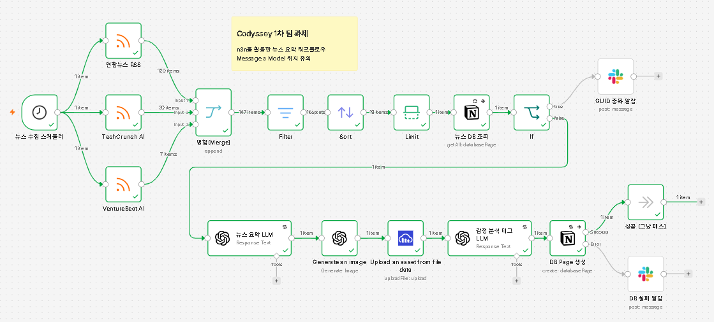
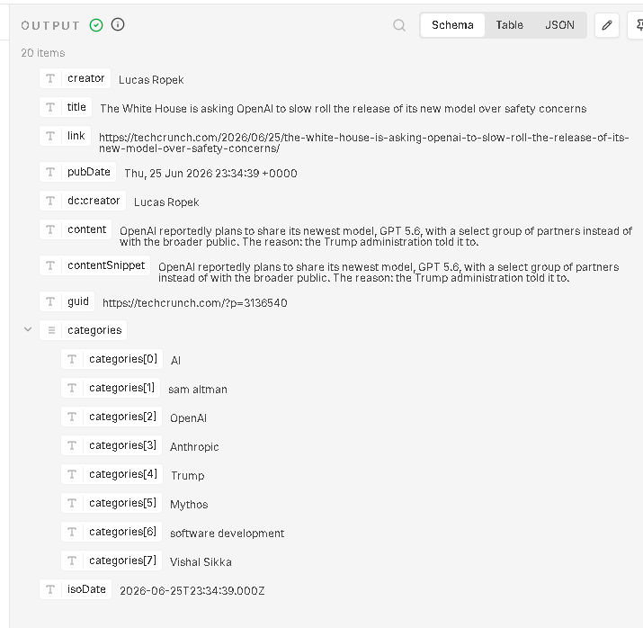
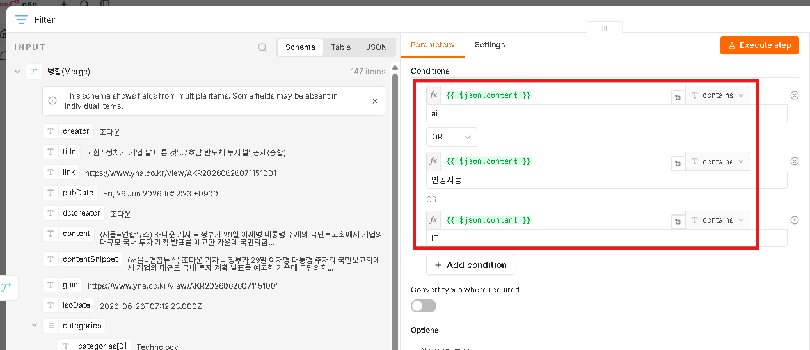
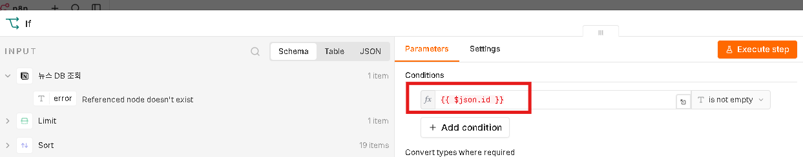
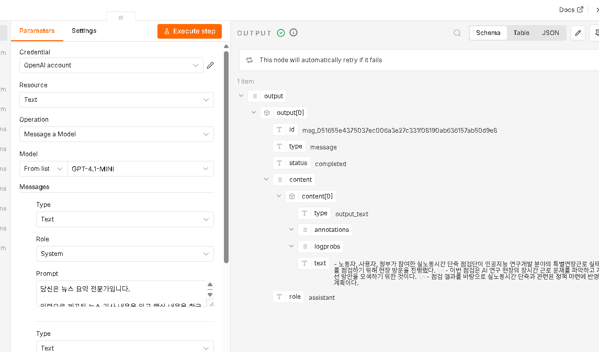
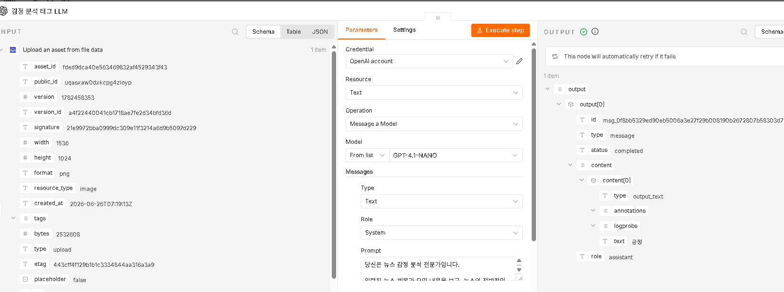
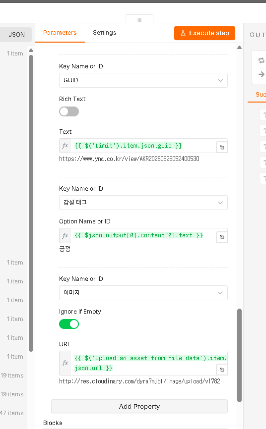
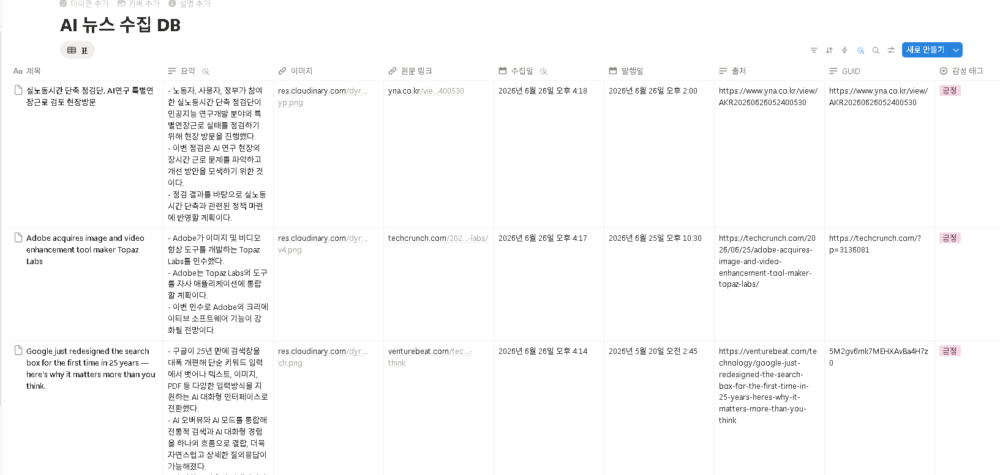
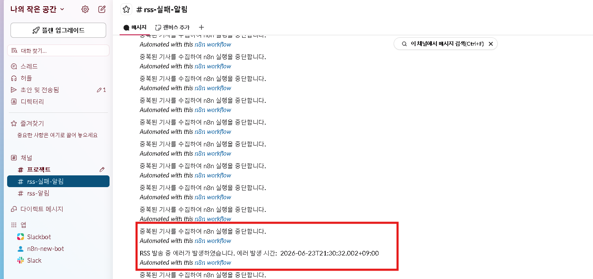
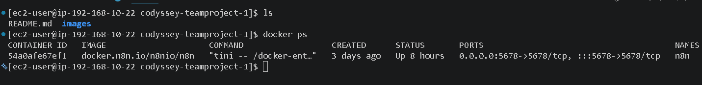

# Codyssey 1차 Team Project - 10팀

## 1. 프로젝트 개요

### 1.1 프로젝트명

n8n 기반 AI/IT 뉴스 요약 자동화 워크플로우

### 1.2 프로젝트 목적

본 프로젝트는 RSS 피드를 통해 최신 AI 및 IT 관련 뉴스를 자동으로 수집하고, 생성형 AI를 활용해 핵심 내용을 요약한 뒤 Notion 데이터베이스에 저장하는 자동화 시스템을 구축하는 것을 목표로 한다.

기존에는 사용자가 직접 여러 뉴스 사이트를 방문하여 기사를 확인하고, 필요한 내용을 정리한 뒤 협업 도구에 저장해야 했다. 본 워크플로우는 이러한 반복 작업을 n8n을 통해 자동화하여 뉴스 수집, 주제 필터링, 랜덤 기사 선택, 중복 확인, AI 요약, 이미지 생성, 감성 분석, Notion 저장까지 하나의 파이프라인으로 구성하였다.

이를 통해 RSS 기반 데이터 수집, AI API 연동, 협업 도구 자동 저장, 중복 방지, 에러 처리 정책까지 포함한 자동화 시스템의 전체 흐름을 이해하고 설명할 수 있다.

### 1.3 비고

**※ 보너스 문제**

필수 조건은 모두 충족하였으며, 하기의 사항들을 추가로 구현하였음.

* 이미지 생성 구현 완료
* 감성 태그 (긍정 / 부정) 완료
* n8n 서버는 AWS 클라우드에서 Docker로 자체 구축하여 서빙함.
    * 학습 목적 및 자체 개인 서버에서 n8n 워크플로우를 가져가기 위함.

### 1.4 참고 문서

* [Slack - n8n 연동 방법](https://wikidocs.net/290920)
* [Notion - n8n 연동 방법](https://wikidocs.net/290908)
* [OpenAI - n8n 연동 방법](https://wikidocs.net/290907)

### 1.5 실제 대시보드 화면 백업

* n8n 팀프로젝트 구축 완성본.json을 n8n에서 import 하면 원본을 복원할 수 있습니다.

---

## 2. 사용 도구


| 구분     | 사용 도구                   | 역할                         |
| ------ | ----------------------- | -------------------------- |
| 자동화 도구 | n8n                     | 전체 워크플로우 구성 및 실행           |
| 데이터 수집 | RSS Feed Read Node      | AI/IT 관련 뉴스 RSS 수집         |
| 데이터 병합 | Merge Node              | 여러 RSS 피드 결과 병합            |
| 주제 필터링 | Filter Node             | AI, 인공지능, IT 키워드 포함 기사만 통과 |
| 랜덤 선택  | Sort Node + Limit Node  | 필터링된 기사 중 랜덤 1건 선택         |
| 중복 확인  | Notion Get All          | GUID 기준 기존 저장 여부 조회        |
| AI 요약  | OpenAI GPT-4.1 Mini     | 뉴스 내용을 3줄 이내로 요약           |
| 이미지 생성 | OpenAI gpt-image-1-mini | 뉴스 주제 기반 썸네일 이미지 생성        |
| 이미지 저장 | Cloudinary              | 생성된 이미지 업로드 및 URL 생성       |
| 감성 분석  | OpenAI GPT-4.1 Nano     | 뉴스 논조를 긍정/부정으로 분류          |
| 결과 저장  | Notion Database         | 요약 결과 및 메타데이터 저장           |
| 알림     | Slack                   | 중복 기사 및 DB 저장 실패 알림        |

---

## 3. 전체 워크플로우 구조

### 3-1. 워크플로우 (실제 구축 화면)

* http://54.116.173.130:5678/ 
* 자체 구축한 n8n 서버이며, 보안 유출로 인하여 해당 사이트 ID/PW는 Git에 공유하지 않았습니다. 접속하여 확인하셔도 되고, 관심있으신 분들은 Discord에서 김동현 이름 검색 후 연락 부탁드립니다.


> 


```text
[1] 뉴스 수집 스케줄러
    - n8n Schedule Trigger
    - 매일 오전 9시에 자동 실행

        ↓

[2] RSS 뉴스 수집
    - 연합뉴스 RSS
    - TechCrunch AI
    - VentureBeat AI

        ↓

[3] 병합(Merge)
    - 3개 RSS 피드에서 수집한 기사 목록을 하나의 흐름으로 병합

        ↓

[4] Filter
    - 기사 본문에 AI, 인공지능, IT 키워드가 포함된 기사만 통과
    - 주제와 관련 없는 기사는 제외

        ↓

[5] Sort
    - 필터링된 기사 목록을 랜덤 순서로 정렬

        ↓

[6] Limit
    - 랜덤 정렬된 기사 중 1건만 선택
    - AI API 호출 비용 절감 및 과제 요구사항 충족

        ↓

[7] 뉴스 DB 조회
    - Notion DB에서 동일 GUID를 가진 기사가 있는지 조회

        ↓

[8] If
    - 조회 결과에 id가 있으면 중복 기사로 판단
    - id가 없으면 신규 기사로 판단

        ↓

[9-1] 중복 기사인 경우
    - Slack으로 GUID 중복 알람 발송
    - 이후 워크플로우 종료

[9-2] 신규 기사인 경우
    - 뉴스 요약 LLM 실행

        ↓

[10] 뉴스 요약 LLM
    - OpenAI GPT-4.1 Mini 사용
    - 뉴스 제목과 본문을 기반으로 한국어 3줄 이내 요약 생성

        ↓

[11] Generate an image
    - OpenAI gpt-image-1-mini 사용
    - 뉴스 제목과 요약을 기반으로 썸네일 이미지 생성

        ↓

[12] Upload an asset from file data
    - 생성된 이미지를 Cloudinary에 업로드
    - 업로드된 이미지 URL 반환

        ↓

[13] 감정 분석 태그 LLM
    - OpenAI GPT-4.1 Nano 사용
    - 뉴스 요약 내용을 기준으로 긍정/부정 감성 태그 생성

        ↓

[14] DB Page 생성
    - Notion DB에 최종 결과 저장
    - 제목, 요약, 원문 링크, 발행일, 수집일, 출처, GUID, 감성 태그, 이미지 URL 저장

        ↓

[15-1] 성공
    - 성공 노드로 이동 후 정상 종료

[15-2] 실패
    - DB 저장 실패 시 Slack으로 실패 알림 발송
```

---

## 4. RSS 데이터 수집

### 4.1 사용 RSS 피드

본 워크플로우는 AI 및 IT 관련 최신 뉴스를 수집하기 위해 다음 3개의 RSS 피드를 사용한다.

| 노드명            | RSS URL                                                         | 선정 이유                                    |
| -------------- | --------------------------------------------------------------- | ---------------------------------------- |
| 연합뉴스 RSS       | `https://www.yna.co.kr/rss/industry.xml`                        | 국내 산업 및 IT 관련 뉴스를 수집하기 위해 사용             |
| TechCrunch AI  | `https://techcrunch.com/category/artificial-intelligence/feed/` | 글로벌 AI 스타트업, 빅테크, 인공지능 산업 동향을 확인하기 위해 사용 |
| VentureBeat AI | `https://venturebeat.com/category/ai/feed/`                     | AI 기술, 기업 도입, 생성형 AI 관련 뉴스를 수집하기 위해 사용   |

### 4.2 수집 데이터

RSS Feed Read 노드를 통해 다음과 같은 데이터를 수집한다.

| 필드      | 설명            |
| ------- | ------------- |
| title   | 기사 제목         |
| link    | 원문 기사 링크      |
| content | 기사 본문 또는 설명   |
| pubDate | 기사 발행일        |
| guid    | RSS 기사 고유 식별자 |


> 

---

## 5. 주제 필터링

### 5.1 필터링 목적

과제 요구사항에 따라 수집된 뉴스 중 사전에 정의한 주제에 해당하는 기사만 처리하기 위해 키워드 기반 필터링을 적용하였다.

본 프로젝트에서는 AI 및 IT 관련 뉴스를 주요 수집 대상으로 설정하였다.

### 5.2 필터링 조건

`Filter` 노드는 RSS 기사 본문에 다음 키워드가 포함된 경우에만 해당 기사를 다음 단계로 전달한다.

| 키워드  | 의미                   |
| ---- | -------------------- |
| AI   | 인공지능 및 AI 산업 관련 기사   |
| 인공지능 | 국내 기사에서 사용되는 한국어 키워드 |
| IT   | 정보기술 및 기술 산업 관련 기사   |

### 5.3 Filter 노드 조건

현재 워크플로우에서는 `content` 필드를 기준으로 다음 조건을 OR 방식으로 검사한다.

```text
content contains ai
OR content contains 인공지능
OR content contains IT
```

즉, 기사 본문에 위 키워드 중 하나라도 포함되어 있으면 AI 요약 대상으로 선정된다.

### 5.4 적용 이유

RSS 피드에는 다양한 주제의 뉴스가 포함될 수 있다. 따라서 모든 뉴스를 처리하지 않고, 프로젝트 주제와 관련 있는 AI/IT 기사만 선별하여 AI 요약 및 Notion 저장 대상으로 사용한다.

이를 통해 불필요한 AI API 호출을 줄이고, Notion 데이터베이스에 저장되는 뉴스의 주제 일관성을 유지할 수 있다.

> 

---

## 6. 랜덤 기사 선택

### 6.1 적용 방식

필터링을 통과한 기사 목록은 `Sort` 노드에서 랜덤 순서로 정렬된다.

이후 `Limit` 노드를 통해 랜덤으로 섞인 기사 중 1건만 선택한다.

```text
Filter
→ Sort: Random
→ Limit: 1건 선택
```

### 6.2 적용 이유

단순히 `Limit` 노드만 사용하면 항상 RSS 결과의 첫 번째 기사만 선택될 수 있다.

따라서 `Sort` 노드의 랜덤 정렬 기능을 먼저 적용한 뒤 `Limit` 노드를 사용하여 매 실행마다 다양한 기사가 선택되도록 구성하였다.

이 방식은 다음과 같은 장점이 있다.

* 매번 동일한 RSS 상단 기사만 처리되는 문제를 줄일 수 있다.
* 필터링된 AI/IT 관련 기사 중 다양한 뉴스를 수집할 수 있다.
* 기사 1건만 처리하기 때문에 AI API 호출 비용을 제한할 수 있다.

---

## 7. 중복 방지 정책

### 7.1 중복 방지 기준

본 워크플로우는 RSS 기사에서 제공하는 `guid` 값을 기준으로 중복 여부를 확인한다.

선택된 기사의 `guid` 값을 Notion 데이터베이스의 `GUID` 속성과 비교하여 동일한 값이 존재하는지 확인한다.

### 7.2 중복 확인 흐름

```text
1. RSS 기사 1건 선택
2. 선택된 기사의 guid 추출
3. Notion DB에서 GUID 값이 동일한 페이지 조회
4. 조회 결과에 id가 있으면 중복 기사로 판단
5. 조회 결과에 id가 없으면 신규 기사로 판단
```

### 7.3 중복 기사 처리

중복 기사로 판단되면 AI 요약, 이미지 생성, 감성 분석, Notion 저장을 수행하지 않는다.

대신 Slack으로 다음 메시지를 전송한다.

```text
중복된 기사를 수집하여 n8n 실행을 중단합니다.
```

### 7.4 적용 이유

워크플로우는 매일 자동 실행되기 때문에 같은 기사가 반복적으로 수집될 수 있다.

GUID 기반 중복 방지를 적용하면 동일 기사가 Notion DB에 여러 번 저장되는 것을 방지할 수 있으며, 중복 기사에 대한 불필요한 AI API 호출도 줄일 수 있다.

> 동일 ID가 없을 경우 다음과 같이 빨간색(False)가 되어, 동일 기사가 없다고 판단하여 Workflow를 실행한다.
> 

---

## 8. AI 요약 기능

### 8.1 사용 모델

뉴스 요약에는 OpenAI의 `gpt-4.1-mini` 모델을 사용한다.

### 8.2 System Prompt

```text
당신은 뉴스 요약 전문가입니다.

입력으로 제공된 뉴스 기사 내용을 읽고 핵심 내용을 한국어로 요약하세요.

규칙:
- 요약은 반드시 3줄 이내로 작성합니다.
- 각 줄은 한 문장으로 작성합니다.
- 기사에 없는 내용은 추측하거나 추가하지 않습니다.
- 광고, 기자 소개, 저작권 문구, 관련 기사 목록은 제외합니다.
- 핵심 사건, 원인/배경, 영향/전망이 드러나도록 요약합니다.
- 문장은 간결하고 자연스럽게 작성합니다.
- 과장된 표현이나 감정적인 표현은 사용하지 않습니다.

출력 형식:
- 불릿 포인트 3개 이내로 작성합니다.
```

### 8.3 User Prompt

선택된 뉴스의 제목과 본문을 n8n 표현식으로 전달한다.

```text
제목:
{{ $('Sort').item.json.title }}

본문:
{{ $('Sort').item.json.content }}

위 뉴스를 요약해 주세요.
```

### 8.4 적용 이유

AI 요약을 통해 사용자는 원문 기사를 모두 읽지 않아도 핵심 내용을 빠르게 파악할 수 있다.

또한 3줄 이내 요약 규칙을 적용하여 Notion 데이터베이스에서 보기 쉬운 형태로 저장되도록 구성하였다.

> 

---

## 9. 썸네일 이미지 생성

### 9.1 사용 모델

뉴스 썸네일 이미지 생성에는 OpenAI의 `gpt-image-1-mini` 모델을 사용한다.

### 9.2 System Prompt

이미지 생성 노드는 뉴스 제목과 AI 요약 결과를 기반으로 뉴스 주제를 상징적으로 표현하는 이미지를 생성한다.

```text
당신은 뉴스 썸네일 이미지 프롬프트를 작성하는 전문가입니다.

규칙:
- 실제 인물, 특정 기업 로고, 언론사 로고, 저작권이 있는 캐릭터는 직접 묘사하지 않습니다.
- 기사 내용을 과장하거나 사실과 다르게 표현하지 않습니다.
- 폭력적, 선정적, 혐오적, 자극적인 이미지는 만들지 않습니다.
- 뉴스의 핵심 주제를 상징적으로 표현합니다.
```

### 9.3 User Prompt

선택된 기사의 제목과 요약 결과(앞 단계 LLM 출력)를 n8n 표현식으로 전달한다.

```text
News title:
{{ $('Limit').item.json.title }}

News summary:
{{ $json.output[0].content[0].text }}
```

### 9.4 이미지 업로드

생성된 이미지는 Cloudinary의 `Upload an asset from file data` 노드를 통해 업로드된다.

Cloudinary 업로드가 완료되면 이미지 URL이 반환되며, 해당 URL은 Notion 데이터베이스의 `이미지` 속성에 저장된다.

> 

---

## 10. 감성 분석 태그

### 10.1 사용 모델

감성 분석에는 OpenAI의 `gpt-4.1-nano` 모델을 사용한다.

### 10.2 System Prompt

감성 분석 태그 LLM은 뉴스 제목과 요약 내용을 기준으로 뉴스의 전반적인 논조와 영향도를 분석한다.

```text
당신은 뉴스 감정 분석 전문가입니다.

입력된 뉴스 제목과 요약 내용을 보고, 뉴스의 전반적인 논조와 영향도를 기준으로 감정 태그를 분류하세요.

분류 기준:
- 긍정: 성장, 성과, 투자, 개선, 출시, 협력, 수상, 기대 효과 등 긍정적 영향이 더 큰 기사
- 부정: 사고, 손실, 규제, 해킹, 갈등, 실패, 하락, 우려, 위험 등 부정적 영향이 더 큰 기사

규칙:
- 반드시 긍정 또는 부정 중 하나만 출력하세요.
- 설명, 문장, 마크다운, 따옴표 없이 태그 하나만 출력하세요.
- 중립적인 기사라도 전체적으로 더 가까운 방향을 선택하세요.
```

### 10.3 분류 기준 (참고)

| 태그 | 기준                                                  |
| -- | --------------------------------------------------- |
| 긍정 | 성장, 성과, 투자, 개선, 출시, 협력, 수상, 기대 효과 등 긍정적 영향이 더 큰 기사  |
| 부정 | 사고, 손실, 규제, 해킹, 갈등, 실패, 하락, 우려, 위험 등 부정적 영향이 더 큰 기사 |

### 10.4 적용 이유

감성 태그를 추가하면 저장된 뉴스를 단순 요약 목록이 아니라, 긍정적 이슈와 부정적 이슈로 구분하여 확인할 수 있다.

이를 통해 이후 Notion DB에서 뉴스 흐름을 빠르게 파악하거나, 긍정/부정 기사 비율을 분석하는 데 활용할 수 있다.

> 

---

## 11. Notion 데이터베이스 저장 구조

### 11.1 Notion DB 이름

AI 뉴스 수집 DB

### 11.2 저장 속성

| Notion 속성 | 타입        | 저장 값               |
| --------- | --------- | ------------------ |
| 제목        | Title     | RSS 기사 제목          |
| 요약        | Rich Text | 뉴스 요약 LLM 결과       |
| 원문 링크     | URL       | RSS 기사 원문 링크       |
| 발행일       | Date      | RSS 기사 발행일         |
| 수집일       | Date      | n8n 스케줄러 실행 시각     |
| 출처        | Rich Text | 원문 링크 또는 출처 정보     |
| GUID      | Rich Text | RSS 기사 GUID        |
| 감성 태그     | Select    | 감성 분석 결과           |
| 이미지       | URL       | Cloudinary 이미지 URL |

### 11.3 저장 예시

```text
제목: AI 반도체 시장 경쟁 심화

요약:
- 글로벌 기업들이 AI 반도체 시장 진출을 확대하고 있다.
- 생성형 AI 서비스 증가로 고성능 연산 인프라 수요가 커지고 있다.
- 향후 클라우드와 데이터센터 투자 경쟁이 더욱 심화될 전망이다.

원문 링크: https://example.com/news/article
발행일: 2026-06-26
수집일: 2026-06-26
출처: https://example.com/news/article
GUID: article-guid-value
감성 태그: 긍정
이미지: https://res.cloudinary.com/example/image/upload/example.png
```

> 

> 

---

## 12. 성공 및 실패 처리

### 12.1 성공 처리

Notion DB Page 생성이 정상적으로 완료되면 `성공 (그냥 패스)` 노드로 이동한다.

해당 노드는 별도의 작업을 수행하지 않고 워크플로우를 정상 종료하는 역할을 한다.

### 12.2 중복 기사 알림

GUID 중복이 확인되면 `GUID 중복 알람` Slack 노드가 실행된다.

전송 메시지는 다음과 같다.

```text
중복된 기사를 수집하여 n8n 실행을 중단합니다.
```

### 12.3 DB 저장 실패 알림

Notion DB Page 생성 단계에서 오류가 발생하면 `DB 실패 알람` Slack 노드가 실행된다.

전송 메시지는 다음과 같다.

```text
RSS 발송 중 에러가 발생하였습니다.
에러 발생 시간: {{ 뉴스 수집 스케줄러 실행 시간 }}
```

> 

---

## 13. 에러 처리 정책

| 상황                | 처리 방식                   |
| ----------------- | ----------------------- |
| RSS 수집 실패         | n8n 실행 로그에서 확인          |
| 필터링 결과 없음         | 이후 단계로 전달할 데이터가 없으므로 종료 |
| 동일 GUID 기사 발견     | Slack 중복 알림 후 종료        |
| AI 요약 실패          | 최대 2회 재시도               |
| 이미지 생성 실패         | n8n 실행 로그에서 확인          |
| Cloudinary 업로드 실패 | n8n 실행 로그에서 확인          |
| 감성 분석 실패          | 최대 2회 재시도               |
| Notion DB 조회 실패   | 오류 발생 시 일반 출력으로 계속 진행   |
| Notion DB 저장 실패   | 최대 2회 재시도 후 Slack 실패 알림 |

### 13.1 재시도 정책

| 노드           | 재시도 여부 | 최대 횟수                      |
| ------------ | ------ | -------------------------- |
| 뉴스 요약 LLM    | 사용     | 2회                         |
| 감정 분석 태그 LLM | 사용     | 2회                         |
| DB Page 생성   | 사용     | 2회                         |
| 뉴스 DB 조회     | 미사용    | 오류 시 continueRegularOutput |
| GUID 중복 알람   | 미사용    | 기본 설정                      |
| DB 실패 알람     | 미사용    | 기본 설정                      |

---

## 14. 비용 절감 정책

본 워크플로우는 AI API 호출 비용을 줄이기 위해 다음 정책을 적용하였다.

1. RSS 수집 후 주제 필터링을 먼저 수행한다.
2. AI/IT 관련 기사만 다음 단계로 전달한다.
3. 랜덤 정렬 후 기사 1건만 선택한다.
4. Notion DB에서 GUID 중복 여부를 먼저 확인한다.
5. 중복 기사일 경우 AI 요약, 이미지 생성, 감성 분석을 수행하지 않는다.
6. AI 요약과 Notion 저장은 최대 2회까지만 재시도한다.

이를 통해 불필요한 API 호출과 무한 재시도로 인한 비용 증가를 방지한다.

---

## 15. 보안 관리

### 15.1 인증 정보 관리

본 워크플로우는 다음 외부 서비스 인증 정보를 사용한다.

* OpenAI API Key
* Notion API Token
* Slack API Token
* Cloudinary API Key

해당 인증 정보는 n8n Credentials 기능을 통해 관리하며, README 문서나 제출용 스크린샷에 직접 노출하지 않는다.

### 15.2 스크린샷 제출 시 주의사항

워크플로우 구조 스크린샷 제출 시 다음 정보는 마스킹한다.

* API Key
* Access Token
* Credential ID
* Slack Channel ID
* Notion Database URL
* 개인 계정 정보
* 내부 서버 주소

---

## 16. 팀 역할 분담

| 이름  | 역할              | 주요 작업                                              |
| --- | --------------- | -------------------------------------------------- |
| 손희영 | RSS 수집 / 테스트    | AI 뉴스 RSS 3개 구성, GUID 기반 기사 선정 기준 정의, 전체 워크플로우 테스트  |
| 박세진 | Notion DB / 구축  | Notion DB 생성 및 공유, 일 단위 백업 정책, n8n 실제 구축           |
| 윤도경 | AI 가공 / 구축      | LLM 3종 프롬프트 작성, 모델 선정 평가축 정리, n8n 실제 구축            |
| 김동현 | 구축 / 문서 취합      | n8n 실제 구축, 보고서(README) 작성 및 취합, 자체 서버(AWS Docker) 구축 |
| 주혜연 | 정책              | 중복/실패 알람 정책 수립, 에러 처리 정책 고민                         |

---

## 17. 개인별 작업 요약

### 손희영 — RSS 수집 / 테스트

* AI/IT 뉴스 수집에 적합한 RSS 피드 3개 조사 및 구성
* 연합뉴스 산업 RSS, TechCrunch AI, VentureBeat AI RSS Feed Read 노드 구성
* GUID가 존재하는 RSS를 기준으로, 기사 1건을 어떤 기준으로 선정할지 정의
* RSS 데이터의 title, link, content, pubDate, guid 필드 확인
* 정상 / 중복 / 실패 시나리오 전반에 대한 워크플로우 테스트 수행

### 박세진 — Notion DB / 구축

* Notion 데이터베이스 생성 및 팀 공유
* 하루 단위로 Notion에 데이터를 백업하는 정책 적용
* n8n 워크플로우 실제 구축 참여

### 윤도경 — AI 가공 / 구축

* LLM 호출 3종에 대한 프롬프트 작성
  * 뉴스 요약 — OpenAI GPT-4.1 Mini
  * 이미지 생성 — (이번 회의 기준 담당 범위에서는 제외, 추후 구현)
  * 긍정/부정 감성 분석 — OpenAI GPT-4.1 Nano
* 각 단계별 모델 선정 기준(평가축) 정리
* n8n 워크플로우 실제 구축 참여

### 김동현 — 구축 / 문서 취합

* n8n 워크플로우 실제 구축 참여
* 보고서(README) 작성 및 팀원 작업 내용 취합
* AWS 클라우드 + Docker 기반 n8n 자체 서버 구축 및 운영

### 주혜연 — 정책

* 중복 기사 및 실패 알람에 대한 정책 수립
* 실패 알람을 어떤 상황에서 어떻게 발송할지에 대한 정책 고민
* 전체 에러 처리 정책 정리

---

## 18. 테스트 케이스

### 18.1 정상 실행 테스트

| 테스트 항목       | 기대 결과                                       |
| ------------ | ------------------------------------------- |
| 스케줄러 실행      | 매일 오전 9시에 워크플로우 실행                          |
| RSS 수집       | 연합뉴스, TechCrunch AI, VentureBeat AI에서 기사 수집 |
| Merge 처리     | 3개 RSS 데이터가 하나의 흐름으로 병합                     |
| Filter 처리    | AI, 인공지능, IT 키워드가 포함된 기사만 통과                |
| Sort 처리      | 필터링된 기사가 랜덤 순서로 정렬                          |
| Limit 처리     | 랜덤 기사 중 1건만 선택                              |
| Notion DB 조회 | GUID 기준으로 기존 기사 여부 확인                       |
| 신규 기사 처리     | 요약, 이미지 생성, 업로드, 감성 분석, Notion 저장 실행        |
| Notion 저장    | 제목, 요약, 링크, 발행일, GUID, 감성 태그, 이미지 URL 저장    |
| 성공 처리        | 성공 노드로 이동 후 정상 종료                           |

### 18.2 중복 기사 테스트

| 테스트 항목         | 기대 결과                 |
| -------------- | --------------------- |
| 동일 GUID 기사 재수집 | Notion DB 조회 결과 id 존재 |
| If 조건 확인       | 중복 기사로 판단             |
| Slack 알림       | GUID 중복 알람 발송         |
| AI API 호출 여부   | 호출하지 않음               |
| Notion 저장 여부   | 저장하지 않음               |

### 18.3 실패 처리 테스트

| 테스트 항목            | 기대 결과             |
| ----------------- | ----------------- |
| AI 요약 실패          | 최대 2회 재시도         |
| 감성 분석 실패          | 최대 2회 재시도         |
| Notion 저장 실패      | 최대 2회 재시도         |
| DB Page 생성 최종 실패  | Slack DB 실패 알람 발송 |
| Cloudinary 업로드 실패 | n8n 실행 로그에서 실패 확인 |
| Slack 알림 전송       | 지정 채널에 실패 메시지 전송  |

---

## 19. 현재 구현 상태

| 기능                 | 구현 여부 | 비고                                     |
| ------------------ | ----- | -------------------------------------- |
| 스케줄 자동 실행          | 구현    | 매일 오전 9시 실행                            |
| RSS 수집             | 구현    | 연합뉴스, TechCrunch AI, VentureBeat AI 사용 |
| RSS 데이터 병합         | 구현    | Merge 노드 사용                            |
| 주제 필터링             | 구현    | AI, 인공지능, IT 키워드 기반 Filter             |
| 랜덤 기사 선택           | 구현    | Sort Random + Limit                    |
| 기사 1건 선택           | 구현    | Limit 노드 사용                            |
| GUID 중복 조회         | 구현    | Notion DB 조회                           |
| 중복 알림              | 구현    | Slack 알림                               |
| AI 뉴스 요약           | 구현    | GPT-4.1 Mini 사용                        |
| 썸네일 이미지 생성         | 구현    | gpt-image-1-mini 사용                    |
| Cloudinary 이미지 업로드 | 구현    | 이미지 URL 생성                             |
| 감성 분석 태그           | 구현    | GPT-4.1 Nano 사용                        |
| Notion DB 저장       | 구현    | DB Page 생성 노드 사용                       |
| DB 실패 알림           | 구현    | Slack 알림                               |

---

## 20. 개선 필요 사항

현재 워크플로우는 과제 요구사항을 대부분 충족하지만, 다음 사항을 개선하면 더 안정적인 구조가 된다.

### 20.1 노드 참조 이름 통일

일부 노드에서 `Sort`, `Limit`, `1개 Limit` 참조가 섞여 있을 수 있다.

최종 선택된 기사 1건은 `Limit` 노드를 기준으로 사용하도록 모든 Expression을 통일하는 것이 좋다.

예시:

```text
{{ $('Limit').item.json.title }}
{{ $('Limit').item.json.content }}
{{ $('Limit').item.json.link }}
{{ $('Limit').item.json.pubDate }}
{{ $('Limit').item.json.guid }}
```

### 20.2 필터링 대상 필드 확장

현재 Filter는 `content` 필드를 기준으로 키워드를 검사한다.

더 정확한 필터링을 위해 `title`, `content`, `contentSnippet`, `description`을 합친 검색용 필드를 만든 뒤 필터링하는 방식으로 개선할 수 있다.

예시:

```text
searchText = title + content + contentSnippet + description
```

### 20.3 대소문자 처리 개선

현재 Filter 조건은 대소문자에 영향을 받을 수 있다.

`AI`, `ai`, `Ai` 등을 모두 처리하려면 검색용 텍스트를 소문자로 변환한 뒤 필터링하는 방식이 더 안정적이다.

### 20.4 이미지 생성 실패 처리 추가

이미지 생성 또는 Cloudinary 업로드 실패 시 전체 워크플로우가 중단될 수 있다.

향후에는 이미지 생성 실패 시에도 텍스트 요약 결과만 Notion에 저장하도록 예외 처리 경로를 추가할 수 있다.

### 20.5 Slack 알림 메시지 개선

현재 Slack 알림은 기본적인 실패 메시지만 포함한다.

장애 확인을 쉽게 하기 위해 기사 제목, 원문 링크, 실패 노드명, 실행 시간을 함께 포함하면 더 좋다.

---

## 21. 기대 효과

본 프로젝트를 통해 팀은 RSS 기반 뉴스 수집부터 AI 요약, 이미지 생성, 감성 분석, Notion 저장까지 이어지는 자동화 파이프라인을 직접 구현하였다.

이를 통해 단순 반복 업무를 자동화하는 방법뿐 아니라, 외부 API 연동, 데이터 중복 방지, 주제 필터링, 실패 처리, 협업 도구 연동 방식을 함께 경험할 수 있었다.

특히 n8n의 노드 기반 구조를 활용하면 코드를 직접 작성하지 않고도 여러 서비스를 연결할 수 있으며, 향후 뉴스 모니터링, 경쟁사 분석, 고객 반응 수집, 업무 보고 자동화 등 다양한 업무 자동화 시스템으로 확장할 수 있다.

---

## 22. 자체 서버 구축 (AWS Docker)

n8n SaaS(클라우드) 버전 대신, 학습 목적과 워크플로우 보존을 위해 AWS 클라우드 인스턴스에 Docker로 n8n 서버를 직접 구축하여 서빙하였다.

### 22.1 docker-compose 구성

``` yaml
services:
  n8n:
    image: docker.n8n.io/n8nio/n8n
    container_name: n8n
    ports:
      - "5678:5678"
    environment:
      GENERIC_TIMEZONE: Asia/Seoul
      TZ: Asia/Seoul

      # 외부에서 접속할 n8n 주소
      N8N_EDITOR_BASE_URL: "http://54.116.173.130:5678/"
      WEBHOOK_URL: "http://54.116.173.130:5678/"

      N8N_ENFORCE_SETTINGS_FILE_PERMISSIONS: "true"
      N8N_RUNNERS_ENABLED: "true"
      N8N_SECURE_COOKIE: "false"
    volumes:
      - n8n_data:/home/node/.n8n
    restart: unless-stopped

volumes:
  n8n_data:
    external: true
```

### 22.2 컨테이너 구동 확인

``` bash
[ec2-user@ip-192-168-10-22 codyssey-teamproject-1]$ docker ps
CONTAINER ID   IMAGE                     COMMAND                  CREATED      STATUS       PORTS                                       NAMES
54a0afe67ef1   docker.n8n.io/n8nio/n8n   "tini -- /docker-ent…"   3 days ago   Up 7 hours   0.0.0.0:5678->5678/tcp, :::5678->5678/tcp   n8
```

> 

---

## 23. 회의록

### 23.1 1차 팀 회의 (2026-06-23 19:00)

프로젝트 초기 역할 분담 및 구현 방향을 정리하기 위한 회의를 진행하였다.

| 담당              | 논의 / 결정 사항                                                                                              |
| --------------- | ------------------------------------------------------------------------------------------------------ |
| 손희영             | RSS 기반 AI 뉴스 수집(3개) 구성, GUID가 있는 RSS에서 기사 1건을 어떤 기준으로 선정할지 정의                                            |
| 박세진             | Notion DB 생성 및 팀 공유, 하루 단위로 Notion에 백업하는 정책 적용                                                          |
| 윤도경             | LLM 호출 3종 프롬프트 작성 — 뉴스 요약(GPT-4.1 Mini) / 이미지 생성(이번 분담에서는 제외) / 긍정·부정 감성 분석(GPT-4.1 Nano), 모델 선정 기준(평가축) 정리 |
| 김동현             | n8n 실제 구축, 보고서(README) 작성 및 취합                                                                          |
| 박세진·윤도경·김동현     | n8n 워크플로우 실제 구축(업무) 공동 담당                                                                              |
| 주혜연             | 실패 알람에 대한 정책 고민 및 에러 처리 정책 정리                                                                          |
| 손희영             | 정상 / 중복 / 실패 시나리오 전반에 대한 테스트                                                                           |

**공통 논의 사항**

* 각 RSS 피드 및 기능 간 공통점 파악
* 워크플로우 전반의 개선점 도출 (→ 본 문서 "20. 개선 필요 사항" 참고)


